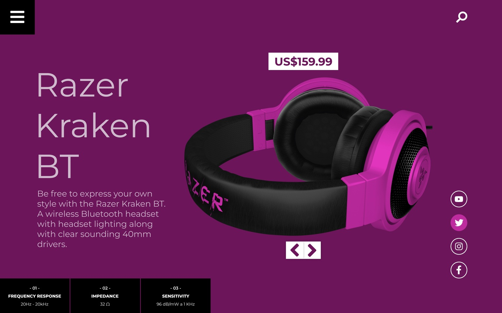
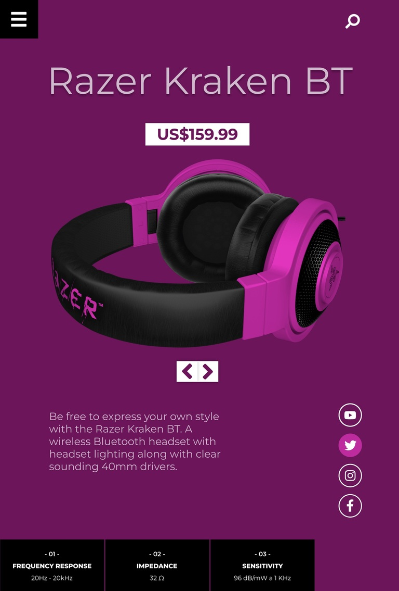
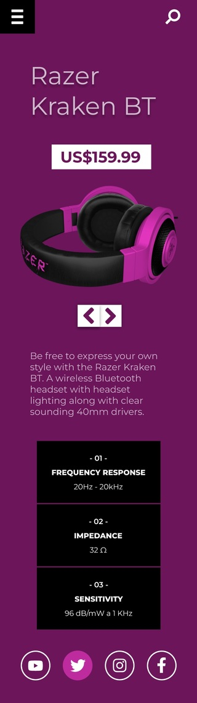

# HEADPHONE-PURPLE

Este projeto foi uma atividade avaliativa da disciplina de Linguagem de Marcação, realizada durante o curso no SENAI Jandira.

O objetivo era criar um site responsivo a partir de um layout desktop fornecido. A primeira etapa consistiu em prototipar as versões de tablet e mobile no Figma, adaptando os elementos, a hierarquia visual e a experiência do usuário para telas menores. 

Na segunda etapa, foi necessário codificar o site responsivo utilizando o framework Tailwind CSS, garantindo que as três versões (desktop, tablet e mobile) funcionassem perfeitamente em diferentes tamanhos de tela.

## Como rodar o projeto localmente

1. Clone o repositório, usando: 

        git clone https://github.com/mica635mrlv/lima_headphone-purple.git

2. Navegue até o diretório do projeto: 
    
        cd lima_headphone-purple

3. Crie um arquivo index.html (ou use o que já está no projeto):

    Na tag head, adicione o script do Tailwind CSS via CDN: 
       
        

4. Abra o arquivo HTML no navegador:

    Não precisa de servidor ou configurações adicionais. Abra o arquivo .html diretamente no seu navegador.

## Screenshots das versões desktop, tablet e mobile

Desktop

Tablet

Mobile

## Tecnologias utilizadas

* HTML
* Tailwind CSS

## Autor

[Milla Regina](https://www.linkedin.com/in/milla-regina-468020206)

